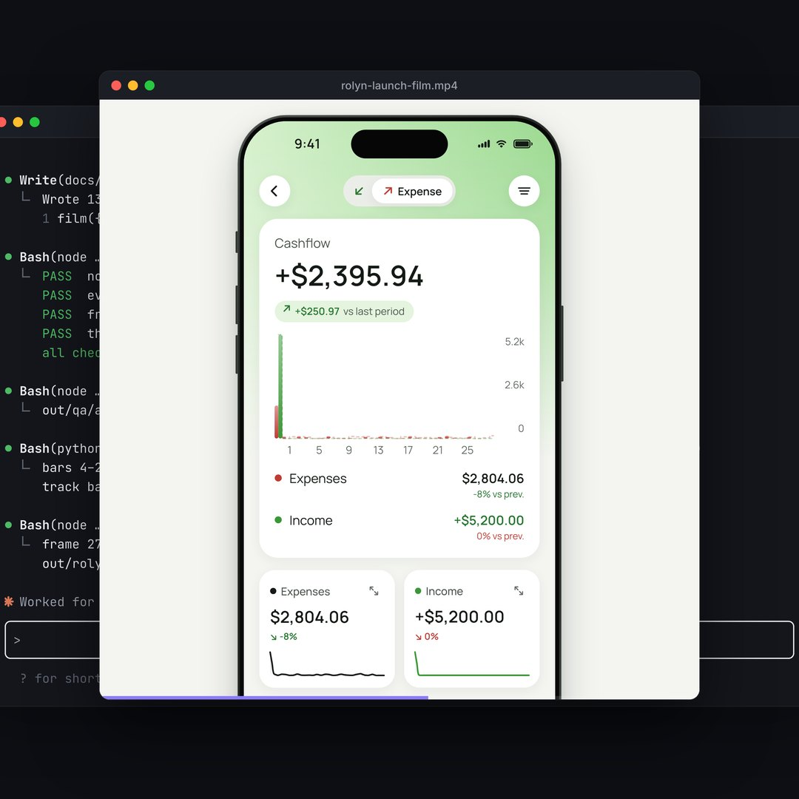

# motion-designer launch film

The skill's own launch film, made with the skill. 60 seconds, 1440 × 1440, 60 fps, cut to 128 BPM.

[](preview.mp4)

A caret opens into Claude Code, someone types `/motion-designer make a video for my app`, and you watch the
skill work: it checks the tools, reads the app, finds the tempo of the track, catches a claim the film must not
make, plans the film, writes it, checks every frame and renders it. On the drop the finished film opens out of
the render's output line. After that you see a desktop film, the choice of a local voice, the real numbers of
the session that made this video, and the install line. The laptop closes into the caret, which types the name
again. The last frame is the first one, so the video loops.

`preview.mp4` is the version with the voiceover. The music-only version, a muted loop and a 1440 master are made
by the render commands below.

## Beat map

| Beats | Time | What happens |
|---|---|---|
| 1–6 | 0:00 | Name and tagline; the caret deletes the word |
| 7–16 | 0:02.8 | The caret opens into a terminal; `/motion` narrows the command menu; the request is typed |
| 17–32 | 0:07.5 | Enter. Tools checked, tempo and drop found, a claim checked in the code, assets packed |
| 33–40 | 0:15.0 | The plan and four stills for approval |
| 41–54 | 0:18.8 | Scenes written, four checks pass, the contact sheet lands frame by frame |
| 55–64 | 0:25.3 | The beat grid of this film's own track, then the render counting frames |
| **65** | **0:30.0** | **Drop.** The Rolyn film opens out of the output line, starting on its own drop |
| 77–84 | 0:35.6 | A desktop film: Oryn |
| 85–98 | 0:39.4 | "add a voiceover", the question about the voice, the local voices |
| 99–115 | 0:45.9 | This film's numbers, then the licence and the install line |
| 116–128 | 0:53.9 | Desktop, laptop, the lid closes into the caret, the name again |

## How it was made

One Claude Code session, from the prompt to the start of the final render: 2 h 21 min of work, 371,277 tokens
written, 111.6 million tokens read (almost all from the cache) and 221 tool calls. Pauses of ten minutes or more
are left out; about two hours of this session were spent waiting on a tool hook that had stopped answering.
`tools/session_stats.py` reads these numbers from the session's transcript into `src/stats.js`, and the film's
counters and closing numbers come from there.

The music is an original instrumental made on the same Mac with ACE-Step 1.5 (MIT). Three takes were generated;
the future bass one was the only one with a real breakdown and drop, so the film uses its bars 17–48, and the
track's drop at bar 33 lands on the film's beat 65. `tools/gen_music.py` makes the takes again from their captions
and seeds, and `tools/downbeat.py` checks where "one" is from chord changes.

The voice is Chatterbox (Resemble AI, MIT), also local, twelve lines with three takes each and the best one kept,
mixed over the music at −16 LUFS. Its output carries Resemble's inaudible watermark.

## What is on screen

- Claude Code's interface is rebuilt in HTML. It belongs to Anthropic and appears here as the place the skill
  runs; no Anthropic logo is used.
- The tool calls in the terminal and their output come from a real run of the skill on Rolyn, from before the
  command was renamed to `/motion-designer`. The `voiceover.py` output is from this film's own voiceover.
- The Rolyn film plays live from `examples/rolyn`. Its merchant logos belong to their owners. Oryn is shown as
  frames of `examples/oryn/preview.mp4`. Both are the author's apps with invented data.
- The sizes and licences of the voices are the ones the skill's setup states.

## Build it again

```bash
S=../../skills/motion-designer/scripts
open src/index.html
node $S/check.mjs src/index.html
node $S/render.mjs video src/index.html out/motion-designer.mp4 --audio audio/edit.m4a --scale 2
python3 $S/voiceover.py voiceover.json
ffmpeg -i out/motion-designer.mp4 -i audio/voiceover-mix.m4a -map 0:v -map 1:a -c copy out/motion-designer-voiceover.mp4
python3 $S/build_single.py src/index.html dist/motion-designer.html
```

`audio/`, `out/`, `dist/` and `assets/img/` are not in the repository; the commands above and below make them.
To make the track again, run `tools/gen_music.py codes` and then
`tools/gen_music.py audio` with ACE-Step's Python, analyse `audio/source/ace-futurebass.wav` with `beats.py`, and
cut bars 17–48 with `music_edit.py` into `audio/edit`. The other derived files come from `tools/make_images.sh`,
`tools/pack_assets.sh`, `tools/pack_films.py` and `tools/wave.py`.

Fonts: Inter and JetBrains Mono, both under the SIL Open Font License (`assets/fonts`).
