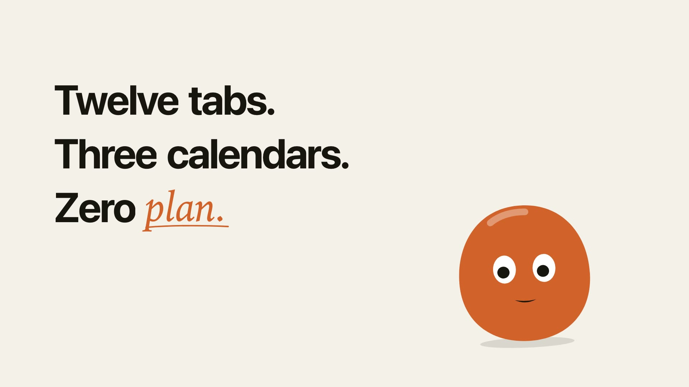

# Story

A story ad for Appname, a made-up planner app: a character, three feature panels and an end card. 27.4 s,
1920 × 1080, 60 fps, 48 beats at 105 BPM, with music and interface sounds and no voice.

[](preview.mp4)

This is the demo that ships in the skill's story template, so its source is
[`templates/story`](../../skills/motion-designer/templates/story) with the tempo set to this track. A real film
starts from the same template (`new_film.sh <dir> story`) and swaps in the brand's words, interface and character.

## Beat map

| Beats | Time | What happens |
|---|---|---|
| 1–8 | 0:00 | "Twelve tabs." "Three calendars." "Zero plan." The character watches the words land |
| 9–12 | 0:04.6 | "Meet Appname." The app rises in its phone and the character hops out of the way |
| 13–20 | 0:06.9 | "Your day, in one list." The list ticks off, one item a beat |
| 21–28 | 0:11.4 | "Twenty-five minutes. Nothing else." The timer runs and do-not-disturb switches on |
| 29–36 | 0:16.0 | "Your week, adding up." The bars grow one by one and the total rolls up to 31 |
| 37–46 | 0:20.6 | The end card: the character lands on the icon, then the wordmark, "Plan less. Do more.", the button and the address |
| 47–48 | 0:26.3 | Everything clears and the character hops back to where it started, so the film loops |

## Sound

In a story the words and the interface do the talking, so the music is a quiet bed and each action on screen
makes its own small sound.

The bed is an original track made on a Mac with ACE-Step 1.5 (MIT). [`music.json`](music.json) is the sound
brief: six takes, each with a caption and a seed. Before rendering anything the skill asked ACE-Step how each
take would come out and dropped three. Guitar came back as darkwave, piano as toy music and plucks as
four-on-the-floor game music. Of the three it rendered, rhodes (seed 17) won: a calm lo-fi groove at 105 BPM
with a clear downbeat and two breaks where the drums stop.

The film uses bars 6–17 of that take. The drums stop under "Zero plan.", come back on "Meet Appname." and stop
again under the end card.

The interface sounds come from `sfx.py`, synthesized from the cues the film lists in `cues()`: ticks as letters
type, a pop on every check, a whoosh on every wipe, a thud when a panel lands, a chime on the logo. They are
tuned to G major, the bed sits under them with a dip at 3.5 kHz, and the mix is at −16 LUFS. Nothing was
downloaded, so there is nothing to credit.

## Make it again

From the repository root:

```bash
S=$PWD/skills/motion-designer/scripts
bash $S/new_film.sh story-demo story
cp examples/story/music.json story-demo/ && cd story-demo
python3 $S/music_gen.py music.json rhodes
python3 $S/beats.py audio/source/ace-rhodes.wav --json audio/grid.json
python3 $S/music_edit.py audio/source/ace-rhodes.wav audio/grid.json --from-bar 6 --bars 12 --out audio/bed
```

`music_edit.py` prints the tempo of the cut. Put it in the first line of `src/scenes.js`
(`film({ W: 1920, H: 1080, BPM: 104.997…, BEATS: 48 })`), then:

```bash
node $S/render.mjs cues src/index.html audio/cues.json
python3 $S/sfx.py audio/cues.json --key "G major" --music audio/bed.wav --out audio/mix
node $S/render.mjs video src/index.html out/story.mp4 --audio audio/mix.m4a
```

The type is the Mac's own (SF Pro and Iowan Old Style). A brand's film packs its fonts with `assets.py` so it
renders the same everywhere.
